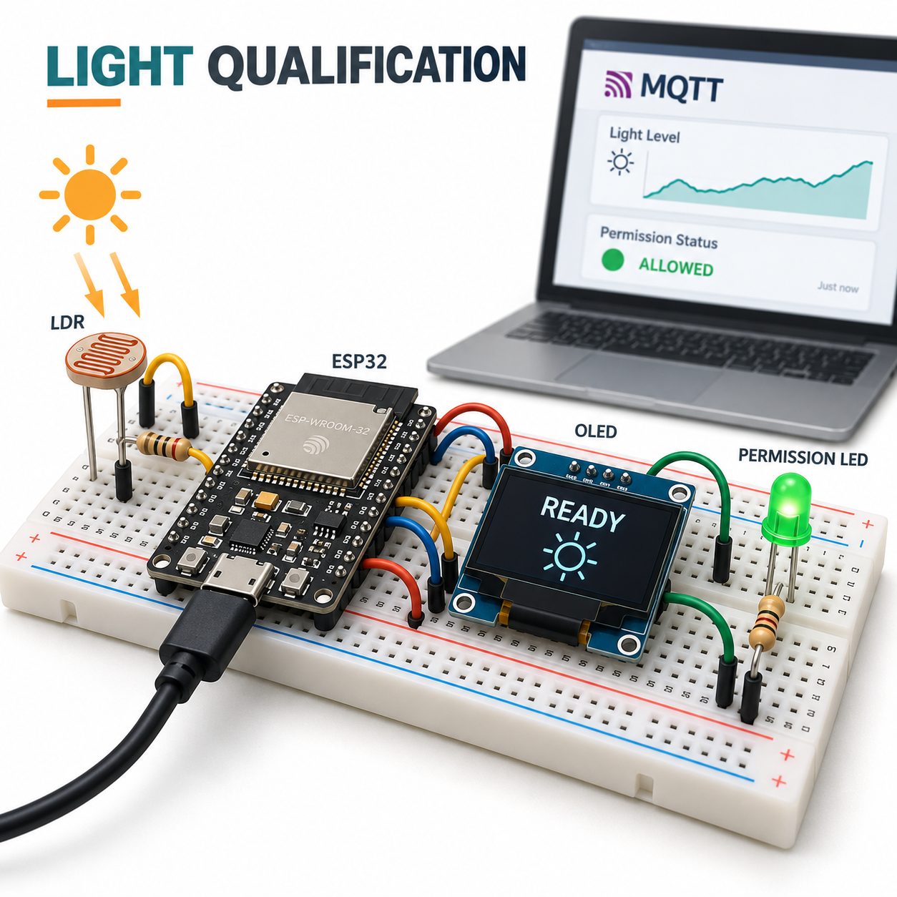

# Smart Entryway Safety Interlock

An ESP32 educational light qualification demonstrator. A light-dependent resistor, OLED and green permission LED show how a controller can refuse ARM and clear a prior permission when a sampled condition or MQTT session fails. It does not control a door or any hazardous equipment.



## Overview, objectives and features

Learn fail-off state transitions, explicit recovery, sensor rail detection, a three-second qualification interval and MQTT telemetry. The local light threshold must hold while the broker session is connected. ARM is a deliberate command; recovering light or connectivity never automatically re-arms. STOP clears permission and restarts qualification. An OLED is optional for operation; USB telemetry remains available if it is absent.

## Architecture and platform

ESP32 DevKit / Arduino reads ADC1 GPIO34 every 100 ms. The shared [Interlock policy](firmware/interlock.h) gates a GPIO25 green LED. I2C displays raw light and reason. A private MQTT broker provides command and state topics through PubSubClient. The source is [firmware/main.cpp](firmware/main.cpp), with deterministic [host tests](tests/interlock_test.cpp). A legacy seed simulator remains for compatibility; the firmware is the documented device implementation.

## BOM quantities

| Quantity | Item |
|---|---|
| 1 | ESP32 DevKit with USB cable |
| 1 | LDR |
| 1 | 10 kΩ divider resistor |
| 1 | 3.3 V-compatible SSD1306 128×64 I2C OLED, address 0x3C |
| 1 each | Green LED and 330 Ω resistor |
| 1 | Breadboard and jumper set |
| 1 | Private Wi-Fi/MQTT test network, broker and host computer |

## Prerequisites

Use Python 3.12, PlatformIO 6.1.18, a 2.4 GHz Wi-Fi lab network and MQTT broker. Firmware pins dependencies: espressif32 6.10.0, Adafruit SSD1306 2.5.13 and PubSubClient 2.8. A USB serial terminal uses 115200 baud. Keep all components within their rated 3.3 V signal levels.

## Exact pin map, circuit and wiring

| ESP32 pin | Connection |
|---|---|
| USB | USB 5 V supply to onboard regulator |
| 3V3 | LDR upper end and OLED VCC |
| GPIO34 / ADC1 | Junction of LDR lower end and 10 kΩ resistor upper end |
| GND | Divider resistor lower end, OLED GND, LED cathode |
| GPIO21 | OLED SDA |
| GPIO22 | OLED SCL |
| GPIO25 | 330 Ω series resistor → green LED anode |

The editable [circuit diagram](docs/circuit-diagram.svg) is authoritative for these connections. More light lowers LDR resistance and raises the ADC reading. The default threshold of 500 is raw 12-bit ADC units, not calibrated lux. Readings 0 and 4095 are treated as invalid rails. These checks cannot detect every wiring fault: a stuck mid-scale reading may look valid. GPIO25 HIGH illuminates the permission LED only.

## Assembly

Disconnect USB, wire the divider and LED polarity, then the OLED at 3.3 V. Inspect for shorts and verify common ground before reconnecting USB. Start with the LED disconnected if unsure of polarity. Do not connect mains, relays, motors, locks or machinery. Test the analog divider with USB telemetry before issuing ARM.

## Setup, configuration and flashing

```sh
python -m pip install platformio==6.1.18
pio run -e esp32dev
pio run -e esp32dev -t upload
pio device monitor -b 115200
```

Create ignored `firmware/config.private.h` with your private `WIFI_SSID`, `WIFI_PASSWORD`, `MQTT_HOST`, `MQTT_USER` and `MQTT_PASSWORD` macros as C string literals. Never commit credentials. Blank defaults build safely but cannot qualify because MQTT connectivity is required. Each physical device needs a unique MQTT client ID; change the source ID before using multiple units.

The example uses MQTT port 1883 without TLS: isolate it to a trusted lab LAN. Broker authentication and network segmentation are required outside a disposable test LAN. For public networks, implement and validate TLS before deployment. ADC threshold 500 and qualification 3000 ms are explicit constants in the policy; calibrate with observed raw readings for a demonstrator.

## Usage and repeatable demonstration

1. With broker connected, illuminate the LDR. Observe `confirming` for three seconds, then `qualified`; the LED remains off.
2. Send USB `ARM\n` or MQTT payload `ARM` to `guard19/command`. Permission turns on only after qualification.
3. Shade the LDR below 500. The next sample clears permission. Restore light, wait three seconds, and verify the LED stays off until a new ARM.
4. Send `STOP`, disconnect the broker, or produce an ADC rail reading. Permission clears; requalification never automatically arms.
5. Unknown, empty or oversized commands execute STOP. MQTT commands must be exactly ARM; USB input trims surrounding whitespace.

```sh
mosquitto_sub -h LAB_BROKER -t 'guard19/#'
mosquitto_pub -h LAB_BROKER -t guard19/command -m ARM
mosquitto_pub -h LAB_BROKER -t guard19/command -m STOP
```

Add broker authentication through your private client configuration. Do not place passwords in shell history.

## Telemetry, data formats and expected output

USB and retained `guard19/state` publish JSON once per second. Fields: integer `id`=19, wrap-prone boot `ms`, raw `light_adc`; booleans `valid`, `connected`, `ready`, `armed`; and reason `offline|invalid|dark|confirming|qualified`. [Sample JSONL](sample-data/interlock.jsonl) is illustrative, not a hardware capture. `guard19/availability` publishes online with a retained offline last will. A retained state is historical; consult availability and freshness before displaying it. OLED shows ADC, reason and permission.

At 600 ADC with a connected broker, 2999 ms of stable qualification rejects ARM; at 3000 ms it accepts. A subsequent reading 499 clears permission. Broker loss detection can take the 15-second keepalive/session timeout plus scheduling; it is not an instantaneous network safety guarantee. OLED or blocking connection attempts can also delay sampling.

## Actual run tests and validation

```sh
g++ -std=c++17 -Wall -Wextra -Werror tests/interlock_test.cpp -o /tmp/interlock
/tmp/interlock
python -m unittest discover -s tests
python tools/validate.py
python tools/validate_completion.py
pio run -e esp32dev
```

Host coverage includes initial rejection, exact qualification boundary, darkness, recovery without automatic arm, offline disarm, invalid rail/flag, STOP and unsigned timer wrap. Image tests reject corruption, mismatched manifests and invalid PNGs. GitHub Actions runs the actual ESP32 target build, PNG signature/CRC/hash/dimensions, SVG parsing, relative links, MIT and credential scans. Image decoding uses a guarded branch workflow and normal push; final-head push and PR gates must both pass. [Validation results](docs/validation-results.md) records executed cloud results once available. Hardware, optical calibration, live Wi-Fi/MQTT and flashing have not been tested.

## Troubleshooting

Offline: check private macros, 2.4 GHz Wi-Fi, broker reachability, authentication and unique client ID. Dark: inspect divider direction and observe raw readings. Invalid: inspect open/short divider and rails. Confirming repeats: light or session is unstable, or STOP was received. OLED blank: check 0x3C address, SDA/SCL and 3.3 V compatibility; its absence does not authorize the LED. Upload failure: select the correct USB port and hold BOOT if required.

## Limitations and domain safety

This is a non-certified permission indicator, not a safety interlock for equipment or people. One sensor, ordinary Wi-Fi/MQTT, a generic MCU, software sampling and one LED cannot establish a safety integrity level. Thresholds are uncalibrated; LDR drift, ambient changes, aliasing, ADC faults, stale commands and session detection delays remain. No watchdog, redundant channel, physical emergency stop or independent power cutoff is implemented. Never use this demonstration for doors, access control, vehicles, medical devices, mains or machinery.

## Future work

Add calibrated illumination, stale-command rejection with sequence/expiry, authenticated TLS, independent diagnostics and measured timing. Any real safety function requires a separate professional hazard assessment and certified hardware design.

## Contributing and license

Discuss behavior changes in an issue, preserve host boundary tests, update wiring and telemetry together, and run the documented gates before a PR. Do not submit secrets or hardware-test claims without evidence. Distributed under the full [MIT license](LICENSE).
